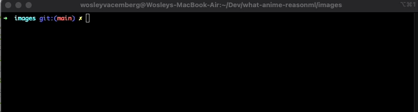

# what-anime-reasonml


This application is a  wrapper around <a href="https://github.com/soruly/trace.moe">trace.moe </a>

<p align="center">PREVIEW</p>
<p align="center"></p>

# Install 

### homebrew

```bash
brew tap bluuesz/what-anime-re
brew install what-anime-re
```

### npm

```bash
npx what-anime-re
```


# Usage 
### Get Anime By Image File 

`what-anime-re file anime.jpg`

### Get Anime By Image Link 

`what-anime-re link https://anime.com/image.png` <br>

# Inspired by
[irevenko/what-anime-cli](https://github.com/irevenko/what-anime-cli)

# License 

[MIT License](https://tldrlegal.com/license/mit-license)